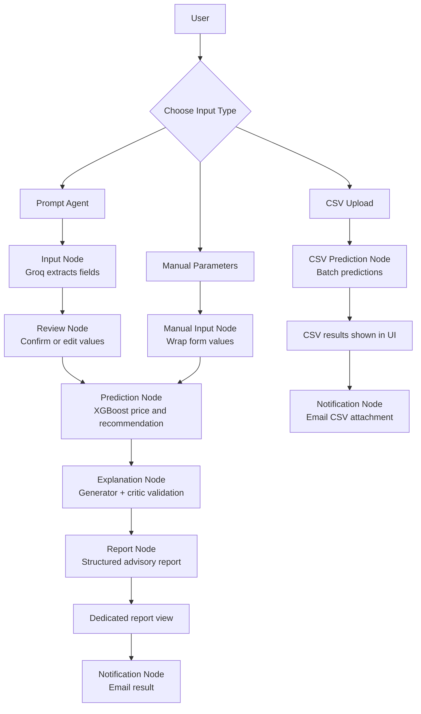

# Property Price Prediction

### Agentic Real Estate Price Prediction with Groq, XGBoost, Streamlit, and Email Notifications

[](https://python.org)
[](https://streamlit.io)
[](https://xgboost.readthedocs.io/)

This project predicts property market price and an advisory recommendation using saved XGBoost models. It also adds a LangGraph-based agentic layer where Groq converts natural-language property descriptions into model-ready fields, explains the prediction with guardrails, and can send the final result by email.

Hosted Streamlit URL: <https://property-price-prediction-real-estate.streamlit.app/>

---

## Overview

The application answers two real-estate questions:

1. What is the estimated **current market price** of the property?
2. What is the predicted **advisory recommendation** of the property?

The current project has two connected parts:

- **ML prediction pipeline:** uses trained XGBoost regression and classification models.
- **Agentic application flow:** uses LangGraph nodes with Groq and modular helpers to extract inputs, explain predictions, and notify users.

The app supports three input modes:

- **Prompt Agent:** user describes the property in normal text.
- **Manual Input:** user enters all fields directly.
- **CSV Upload:** user uploads many properties for batch prediction.

---

## System Architecture

### Architecture Diagram


### Active LangGraph Workflow

The application is orchestrated by `app/property_graph.py`, which connects the workflow as LangGraph nodes:

For the detailed agent documentation, state evolution, guardrails, and edge-case handling, see [`agent_workflow.md`](agent_workflow.md).

| Node | File | Responsibility |
| --- | --- | --- |
| Input Node | `app/input_nodes.py` | Extracts property fields from a user prompt using Groq and fills missing fields with defaults. |
| Review Node | `app/property_graph.py` | Marks prompt extraction as ready for the Streamlit human-review popup. |
| Prediction Node | `app/prediction_nodes.py` | Loads the saved model artifacts, builds model-ready features, and predicts price/grade/confidence. |
| Explanation Node | `app/explanation_nodes.py` | Uses generator and critic Groq prompts to produce a grounded, validated explanation. |
| Report Node | `app/report_generator.py` | Builds one structured advisory report from prediction, inputs, comparables, explanation, and risk warning. |
| Notification Node | `app/notification_nodes.py` | Formats prediction results and sends single-result or CSV-result emails through SMTP. |
| CSV Prediction Node | `app/property_graph.py` | Runs batch predictions for uploaded CSV files. |



The graph has three entry paths:

- **Prompt Agent path:** uses Groq to extract fields, pauses for user review, predicts with XGBoost, validates the explanation with a critic prompt, builds a structured report, and can email the final result.
- **Manual Parameters path:** skips prompt extraction because values are already structured, then reuses the same prediction, explanation, report, and email nodes.
- **CSV Upload path:** runs a batch prediction node for all rows and can email the generated CSV attachment.

---

## Data Flow From Input To Output

### 1. User Input

The user enters data through one of three Streamlit pages:

- **Prompt Agent:** a natural-language sentence such as `1450 sqft 3 BHK, 2 bathrooms, IT Hub, 4.5 km from city center`.
- **Manual Input:** direct form fields for all numeric and categorical property values.
- **CSV Upload:** a CSV file containing either raw property fields or already encoded model features.

### 2. Input Processing

For prompt input, the LangGraph input node calls `app/input_nodes.py` and sends the text to Groq using `GROQ_API_KEY`. Groq returns JSON containing:

- numeric property fields,
- furnishing status,
- neighborhood.

If the prompt does not mention a field, the app fills it using defaults from `data/processed/real_estate_clean.csv`. If no Groq key is configured, the app can use a local rule-based fallback for demo safety, but the intended agentic mode is Groq extraction.

For manual input, values are already structured by the form.

For CSV upload, the app accepts:

- raw columns such as `Total_Square_Footage`, `Bedrooms`, `Furnishing_Status`, and `Neighborhood`, or
- encoded feature columns matching the saved scaler/model schema.

### 3. Review And Confirmation

Prompt input opens a review popup before prediction. Each value is labeled by source:

- **Prompt:** extracted from the user's text by Groq.
- **Default:** filled by the app because the user did not provide it.
- **Edited:** changed by the user before prediction.

Only the fields actually changed in the edit popup are marked as **Edited**.

### 4. Feature Construction

The LangGraph prediction node calls `app/prediction_nodes.py` to convert confirmed user-facing fields into the feature format used during training:

- numeric fields are placed in the saved feature order,
- `Furnishing_Status` is ordinal encoded,
- `Neighborhood` is one-hot encoded,
- missing CSV numeric values are filled with training-data medians.

### 5. Model Prediction

The Prediction Node loads these artifacts from `models/`:

- `xgb_regression_model.joblib`
- `regression_scaler.joblib`
- `xgb_classification_model.joblib`
- `classification_scaler.joblib`

The app then:

1. scales the feature row,
2. predicts market price with `XGBRegressor`,
3. predicts advisory class with `XGBClassifier`,
4. calculates confidence from the highest class probability.

### 6. Explanation Generation

The Explanation Node calls `app/explanation_nodes.py` and sends the confirmed property inputs, model output, confidence, and comparable properties to Groq. It uses a two-step generator-critic pattern:

1. the **Generator Agent** creates the first grounded explanation,
2. the **Critic Agent** validates whether every claim is supported by the same JSON facts,
3. the app shows the approved explanation or a corrected safe explanation.

The final explanation keeps exactly four short bullets: **Summary**, **Market Context**, **Recommendation**, and **Risk Warning**.

### 7. Structured Report Generation

The Report Node calls `app/report_generator.py` after explanation. It combines:

- prediction summary,
- Avoid / Hold / Buy recommendation,
- confirmed property details,
- Prompt / Default / Edited source counts,
- comparable training examples,
- model probability table,
- grounded explanation,
- risk warning and disclaimer.

This report is shown in a dedicated on-screen report view before the optional email feature.

### Prompting Guardrails To Reduce Hallucinations

The project explicitly uses these anti-hallucination strategies:

- **Grounding:** the explanation prompt includes only confirmed inputs, predicted price, advisory class, confidence, and comparable rows from the training data.
- **Generator-critic validation:** one Groq step drafts the explanation, and a second critic step checks it against the same grounded JSON.
- **Self-check instruction:** Groq is told to say "Based on the model output" when a claim is uncertain and not to present likely reasons as exact feature importance.
- **Output constraint:** Groq must return exactly four labeled bullets, which keeps the response structured and prevents unsupported extra content.
- **Report node:** the UI displays one structured advisory report instead of relying only on metric widgets.
- **Fallback behavior:** if Groq explanation fails, the app shows a deterministic local explanation instead of breaking the prediction page.

### 8. Notification

The Notification Node calls `app/notification_nodes.py` and sends results by email using SMTP credentials from `.env`, environment variables, or Streamlit secrets.

Single prediction emails include:

- predicted price,
- advisory recommendation,
- confidence,
- property summary,
- source labels showing Prompt / Default / Edited,
- highlighted explanation text for quick reading.

CSV prediction emails attach the generated batch prediction CSV.

---

## Repository Structure

```text
property-price-prediction/
├── .env.example
├── .gitignore
├── agent_workflow.md
├── app/
│   ├── streamlit_app.py
│   ├── config.py
│   ├── property_graph.py
│   ├── input_nodes.py
│   ├── prediction_nodes.py
│   ├── explanation_nodes.py
│   ├── report_generator.py
│   ├── notification_nodes.py
│   ├── pages.py
│   └── styles.py
├── .streamlit/
│   └── config.toml
│
├── data/
│   ├── raw/
│   │   └── real_estate_raw.csv
│   └── processed/
│       └── real_estate_clean.csv
│
├── models/
│   ├── xgb_regression_model.joblib
│   ├── regression_scaler.joblib
│   ├── xgb_classification_model.joblib
│   └── classification_scaler.joblib
│
├── notebooks/
│   └── training_colab.ipynb
├── report/
│   ├── milestone_2_report.pdf
│   ├── milestone_2_report.tex
│   ├── property_price_prediction_report.pdf
│   └── property_price_prediction_report.tex
├── system_architecture.png
├── requirements.txt
├── runtime.txt
└── README.md
```

The repository intentionally keeps generated files, local secrets, virtual environments, caches, and operating-system metadata out of version control.

---

## Quickstart

### 1. Create And Activate A Virtual Environment

```bash
python3 -m venv venv
source venv/bin/activate
```

On Windows:

```bash
venv\Scripts\activate
```

### 2. Install Dependencies

```bash
pip install -r requirements.txt
```

### 3. Configure Local Secrets

Create a local `.env` file from the safe placeholder template:

```bash
cp .env.example .env
```

Then replace the placeholder values:

```bash
GROQ_API_KEY=your-groq-api-key
GROQ_MODEL=llama-3.3-70b-versatile
GROQ_API_URL=https://api.groq.com/openai/v1/chat/completions

EMAIL_SMTP_HOST=smtp.gmail.com
EMAIL_SMTP_PORT=587
EMAIL_SENDER=your-project-email@gmail.com
EMAIL_APP_PASSWORD=your-gmail-app-password
EMAIL_FROM_NAME=Property Predictor
```

For Gmail, `EMAIL_APP_PASSWORD` must be a Gmail app password, not the normal Gmail login password.

For Streamlit Cloud deployment, add the same key-value pairs in the app secrets panel.

### 4. Run The App

```bash
streamlit run app/streamlit_app.py
```

The local app opens at:

```text
http://localhost:8501
```

---

## Environment Variables

| Variable | Required For | Purpose |
| --- | --- | --- |
| `GROQ_API_KEY` | Prompt extraction and explanation | Authenticates Groq API requests. |
| `GROQ_MODEL` | Prompt extraction and explanation | Selects the Groq model, defaulting to `llama-3.3-70b-versatile`. |
| `GROQ_API_URL` | Optional | Overrides the Groq chat completions endpoint. |
| `EMAIL_SMTP_HOST` | Email notification | SMTP host, usually `smtp.gmail.com`. |
| `EMAIL_SMTP_PORT` | Email notification | SMTP port, usually `587`. |
| `EMAIL_SENDER` | Email notification | Sender email address. |
| `EMAIL_APP_PASSWORD` | Email notification | Sender email app password. |
| `EMAIL_FROM_NAME` | Email notification | Display name shown in the email. |

Local `.env` files and `.streamlit/secrets.toml` are ignored by Git so API keys and email credentials do not get committed.

---

## Model Inputs

The model expects these raw user-facing fields:

| Field | Meaning |
| --- | --- |
| `Total_Square_Footage` | Total property area in square feet. |
| `Bedrooms` | Number of bedrooms. |
| `Bathrooms` | Number of bathrooms. |
| `Age_of_Property` | Property age in years. |
| `Floor_Number` | Floor number. |
| `Furnishing_Status` | `Unfurnished`, `Semi-furnished`, or `Fully-furnished`. |
| `Distance_to_City_Center_km` | Distance from city center in kilometers. |
| `Proximity_to_Public_Transport_km` | Distance from public transport in kilometers. |
| `Crime_Index` | Crime index for the area. |
| `Air_Quality_Index` | Air quality index for the area. |
| `Neighborhood_Growth_Rate_%` | Neighborhood growth rate percentage. |
| `Price_per_SqFt` | Price per square foot. |
| `Annual_Property_Tax` | Annual property tax amount. |
| `Estimated_Rental_Yield_%` | Estimated rental yield percentage. |
| `Neighborhood` | One of `Downtown`, `IT Hub`, `Industrial`, `Residential`, or `Suburban`. |

---

## Model Training Summary

The training work is stored in `notebooks/training_colab.ipynb`, with cleaned data in `data/processed/real_estate_clean.csv`.

Training steps:

1. Load `data/raw/real_estate_raw.csv`.
2. Handle missing numeric values using median imputation.
3. Encode `Furnishing_Status` as ordinal values.
4. One-hot encode `Neighborhood`.
5. Clip outliers using the IQR method.
6. Train an XGBoost regression model for `Current_Market_Price`.
7. Train an XGBoost classification model for `Investment_Grade`.
8. Save models and scalers into `models/` using `joblib`.

### Saved Model Artifacts

| Artifact | Purpose |
| --- | --- |
| `models/xgb_regression_model.joblib` | Predicts current market price. |
| `models/regression_scaler.joblib` | Scales regression features. |
| `models/xgb_classification_model.joblib` | Predicts advisory class `0 / 1 / 2`. |
| `models/classification_scaler.joblib` | Scales classification features. |

### Advisory Class Labels

The classification model still predicts numeric classes, but the UI and email
show them as clear advisory labels:

| Model Class | UI Label | Meaning |
| --- | --- | --- |
| `0` | Avoid | Weakest class in the trained model output. |
| `1` | Hold | Moderate class; review the details carefully. |
| `2` | Buy | Strongest class in the trained model output. |

These labels are used for project explanation only and are not professional investment advice.

---

## Results

Metrics from the recorded training run:

| Metric | Value |
| --- | --- |
| Regression R2 Score | **0.9483** |
| Regression MAE | **Rs 550,851** |
| Regression RMSE | **Rs 1,010,636** |
| Classification Accuracy | **97.50%** |
| Classification Weighted F1 | **0.97** |

---

## Tool Deep-Dive

| Library | Role In This Project |
| --- | --- |
| Streamlit | Builds the complete UI, including navigation, prompt input, review/edit dialogs, CSV upload, prediction display, comparable-property tables, and email forms. |
| LangGraph | Orchestrates the project as clear nodes: input, review, prediction, explanation, report generation, CSV prediction, and notification. This makes the agentic flow easy to explain during evaluation. |
| Groq API | Powers natural-language prompt extraction and grounded prediction explanations through a fast hosted LLM endpoint. |
| pandas | Loads CSV data, validates uploaded files, computes defaults, builds feature rows, prepares comparable-property tables, and exports prediction CSVs. |
| scikit-learn | Provides saved scalers used to transform inference features exactly like training features. |
| XGBoost | Provides the regression model for price prediction and the classification model for investment-grade prediction. |
| joblib | Loads saved model and scaler artifacts from the `models/` directory. |
| urllib | Sends Groq API requests using Python's standard library, avoiding an extra provider SDK dependency. |
| smtplib / email | Sends formatted result emails and CSV attachments through SMTP. |

---

## Design Choices And Justification

### Why XGBoost For Prediction

The dataset is structured and tabular, with numeric property attributes and encoded categorical features. XGBoost is a strong fit because it captures non-linear relationships between features such as square footage, price per square foot, rental yield, location distance, and neighborhood indicators. It also performs well on medium-sized tabular datasets without requiring deep-learning infrastructure.

### Why LangGraph For Agentic Flow

The project has multiple steps that behave like an agentic workflow: extracting user intent, pausing for human confirmation, running prediction, explaining the result with guardrails, and optionally sending a notification. LangGraph was chosen because each step can be represented as a named node with a shared state. This makes the workflow easier to debug, demonstrate, and explain in the final report.

### Why Groq And Llama-3.3-70B

Groq was selected for the LLM layer because it provides fast hosted inference and is convenient for student-project demos. The `llama-3.3-70b-versatile` model is used for two tasks: converting natural-language property prompts into structured JSON fields, and generating short grounded explanations after prediction. This keeps the ML model deterministic while using the LLM only for language understanding and explanation.

### Why Streamlit For The Interface

Streamlit allows the project to expose the full workflow quickly: prompt input, CSV upload, manual parameters, review popups, prediction metrics, comparable properties, and email delivery. It is also easy to run locally and deploy for review.

### Why SMTP Email Instead Of WhatsApp

Email notification was chosen because it is easier to configure with standard SMTP credentials and does not require paid messaging APIs, phone-number verification, or WhatsApp Business setup. It still demonstrates a complete notification node in the agentic workflow.

### Why A Vector DB / FAISS Was Not Used

A vector database such as FAISS is useful when the data is mostly unstructured text and retrieval depends on semantic similarity. This project uses structured property data with clear columns such as neighborhood, square footage, bedrooms, and price. For comparable-property retrieval, deterministic row-based filtering is more precise and interpretable: the app filters by same neighborhood, keeps square footage within a 25% range, then sorts by price proximity. This is easier to justify in a real-estate setting than embedding-based similarity, where the reason for a match can be less transparent.

---

## Report Writing Notes

This README can be used as the base for the final report. A clean report structure would be:

1. **Problem Statement:** property valuation and investment-grade prediction.
2. **Dataset And Features:** raw/processed data, numeric features, furnishing encoding, and neighborhood one-hot encoding.
3. **Model Development:** preprocessing, XGBoost regression, XGBoost classification, and saved artifacts.
4. **Agentic Workflow:** LangGraph nodes for input, review, prediction, explanation, report generation, CSV prediction, and notification.
5. **User Interface:** Streamlit pages for Prompt Agent, CSV Upload, Manual Input, and About.
6. **Notification System:** SMTP email with prediction summary, source labels, comparable properties, explanation, and disclaimer.
7. **Design Justification:** why XGBoost, LangGraph, Groq, Streamlit, SMTP, and deterministic comparable-property retrieval were chosen.
8. **Key Learnings:** what was learned from combining ML, LLMs, LangGraph, UI design, and notifications.
9. **Results And Limitations:** model metrics, dataset dependency, prompt extraction limitations, and non-advisory disclaimer.

---

## Streamlit Pages

| Page | What It Does |
| --- | --- |
| Prompt Agent | Runs the LangGraph flow: prompt extraction, review, prediction, validated explanation, structured report, and email. |
| CSV Upload | Runs batch prediction from a CSV and can email the output file. |
| Manual Input | Lets the user directly enter values, then predicts, explains, and emails the result. |
| About | Summarizes the agentic workflow, models, metrics, and project files. |

---

## Key Learnings

- **LLMs are most useful around the ML model, not as a replacement for it:** Groq handles language extraction and explanation, while XGBoost remains responsible for numeric prediction.
- **Human review improves trust:** the Prompt Agent pauses before prediction so users can inspect defaults and edit values before the model runs.
- **Structured data should use structured retrieval:** comparable properties are found through clear filters instead of semantic vector similarity, making the result easier to explain.
- **Node-based design improves clarity:** LangGraph separates input, review, prediction, explanation validation, report generation, CSV prediction, and notification into understandable workflow blocks.
- **Deployment needs secret hygiene:** `.env.example` documents required keys, while real API keys and email credentials stay out of version control.

---

## Limitations

- Predictions depend on the dataset used during training.
- Prompt extraction quality depends on the Groq response and the clarity of the user's text.
- The local rule parser is only a fallback when `GROQ_API_KEY` is missing.
- The explanation agent gives a human-readable interpretation, not exact feature-importance values.
- Email sending requires correct SMTP credentials and may require app-password setup for Gmail.

---

## Future Enhancements

- Add SHAP-based feature contribution charts for stronger model explainability.
- Add input drift monitoring for uploaded CSVs.
- Add scheduled retraining when new validated property data is available.
- Add richer email templates for batch summaries.
- Add validation ranges for all numeric fields to catch unrealistic property values.
