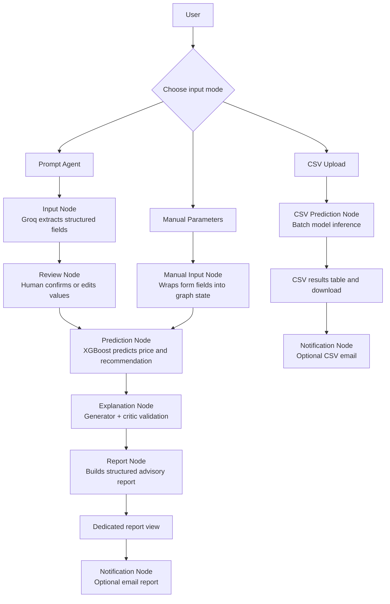

# Agent Workflow Documentation

This file explains the agentic flow used in the Property Price Prediction project.
The goal is to show how the system moves from user input to model prediction,
where human review happens, and which guardrails reduce hallucinations.

---

## 1. High-Level Flow

The application has three input paths. All of them are wrapped by LangGraph so the
workflow is visible as nodes instead of hidden inside one long script.

---

## 2. How The Agents Are Internally Wrapped

The main wrapper is `app/property_graph.py`.

- `PropertyWorkflowState` is the shared state object passed between LangGraph nodes.
- Each node reads only the keys it needs and writes the next keys into state.
- Streamlit pages call runner functions such as `run_prompt_review_graph()` and
  `run_confirmed_prediction_graph()` instead of calling every helper directly.
- The helper files keep responsibilities separate:
  - `app/input_nodes.py` handles Groq prompt extraction and input defaults.
  - `app/prediction_nodes.py` handles feature construction, ML model inference, and comparables.
  - `app/explanation_nodes.py` handles grounded prediction explanations.
  - `app/report_generator.py` builds the structured advisory report shown in the UI.
  - `app/notification_nodes.py` handles optional email delivery.
  - `app/pages.py` handles Streamlit UI, popups, review tables, and advisory reports.

This structure makes the project easier to explain: the user interface is separate
from the agent nodes, and the ML model is separate from the LLM logic.

---

## 3. Node-by-Node Explanation

| Node | File | Reads From State | Writes To State | What It Does |
| --- | --- | --- | --- | --- |
| Input Node | `app/property_graph.py` + `app/input_nodes.py` | `prompt`, `context`, `input_settings` | `mode`, `flow` | Sends the user's text to Groq, extracts known property fields, and fills missing values from training-data defaults. |
| Review Node | `app/property_graph.py` | `flow` | `review_ready` | Marks the extracted values as ready for the Streamlit review popup. |
| Manual Input Node | `app/property_graph.py` | `numeric_inputs`, `furnishing`, `neighborhood` | `mode`, `flow` | Converts manual form values into the same `flow` format used by the prompt path. |
| Prediction Node | `app/property_graph.py` + `app/prediction_nodes.py` | `flow`, `context` | `result`, `comparables` | Builds model features, runs XGBoost regression/classification, calculates confidence, and retrieves comparable training examples. |
| Explanation Node | `app/property_graph.py` + `app/explanation_nodes.py` | `flow`, `result`, `comparables`, `explanation_settings` | `explanation` | Sends only grounded model facts to Groq, drafts an explanation, and validates it with a critic prompt. |
| Report Node | `app/property_graph.py` + `app/report_generator.py` | `flow`, `result`, `explanation`, `comparables` | `report` | Converts prediction outputs into one structured advisory report with summary, inputs, comparables, technical evidence, and risk warning. |
| CSV Prediction Node | `app/property_graph.py` + `app/prediction_nodes.py` | `input_df`, `context` | `mode`, `output_df` | Validates CSV columns and runs batch predictions for every row. |
| Notification Node | `app/property_graph.py` + `app/notification_nodes.py` | `recipient`, `result`, `flow`, `explanation`, `comparables`, `email_settings` | `email_sent` | Sends the final report by email only when the user enters a recipient and clicks send. |

---

## 4. What The Agent Does Autonomously

The system makes these decisions automatically:

- maps natural-language phrases into allowed model fields,
- ignores unknown fields that are not part of the model schema,
- fills missing prompt values with training-data defaults,
- converts raw values into encoded model features,
- predicts price, advisory class, and confidence,
- retrieves comparable properties from the training data,
- generates and validates a grounded explanation from confirmed values and model outputs,
- assembles one structured advisory report from all outputs,
- falls back to a safe local explanation if Groq explanation fails.

The system requires human input for these decisions:

- choosing Prompt Agent, Manual Input, or CSV Upload,
- entering the prompt, form values, CSV file, or recipient email,
- confirming extracted prompt values before prediction,
- editing any value that the user does not agree with,
- deciding whether to send the optional email report.

---

## 5. State Evolution

### Prompt Agent Path

| Step | Important State Keys |
| --- | --- |
| User enters text | `prompt` |
| Input Node extracts values | `flow.numeric_inputs`, `flow.furnishing`, `flow.neighborhood`, `flow.sources`, `flow.agent_warning` |
| Review popup opens | `review_ready=True` |
| User edits or confirms | updated `flow`, with only changed fields marked `Edited by user` |
| Prediction Node runs | `result.price`, `result.grade`, `result.confidence`, `result.probabilities`, `comparables` |
| Explanation Node runs | `explanation` |
| Report Node runs | `report.summary`, `report.property_summary`, `report.probabilities`, `report.comparables`, `report.risk_warning` |
| UI displays result | advisory card plus dedicated report tabs for report, inputs, comparables, and technical details |
| Optional email | `recipient`, `email_sent=True` |

### Manual Input Path

Manual input skips Groq extraction. The Manual Input Node wraps the form values
into `flow`, then reuses the same Prediction Node, Explanation Node, Report
Node, advisory report UI, and optional Notification Node.

### CSV Upload Path

CSV upload uses `input_df` and returns `output_df`. It does not call the
Explanation Node for every row because that would be slow and distracting for
batch prediction. The main output is the completed prediction CSV.

---

## 6. Guardrails And Anti-Hallucination Strategies

### Guardrail 1: Schema-Locked Input Extraction

The Input Node tells Groq to return JSON only with these allowed keys:

- `numeric_inputs`
- `furnishing_status`
- `neighborhood`

Any unknown keys are ignored. Values that cannot be converted into numbers are
ignored instead of breaking the app. If the prompt looks like a general question
or does not include property details, the app shows a warning and fills defaults
only for review.

### Guardrail 2: Human Review Before Prediction

The Prompt Agent never predicts immediately after Groq extraction. It first shows
a review popup with each value and source:

- `Prompt` means extracted from the user's text,
- `Default` means filled from training data,
- `Edited` means changed by the user.

This prevents hidden defaults from silently becoming final model inputs.

### Guardrail 3: Grounded Explanation Prompt

The Explanation Node sends Groq a compact JSON object containing only:

- confirmed property inputs,
- predicted price,
- advisory class,
- confidence,
- comparable properties from the training data,
- source-label rules.

The system prompt explicitly says not to invent outside market facts, legal
claims, financial advice, or exact feature importance. It also says to use
"Based on the model output" for uncertain claims.

### Guardrail 4: Generator-Critic Cross-Validation

The explanation is not accepted directly from the first Groq response. The
Explanation Node uses two LLM-facing roles:

- **Generator Agent:** writes the first explanation from the grounded JSON.
- **Critic Agent:** checks whether every claim is supported by the same JSON and
  either approves it or returns a safer corrected explanation.

This demonstrates a stronger anti-hallucination strategy than a single weak
system prompt line.

### Guardrail 5: Output Format Constraint

The Explanation Node asks Groq for exactly four bullets:

- **Summary**
- **Market Context**
- **Recommendation**
- **Risk Warning**

This keeps the explanation short, structured, and less likely to drift into
unsupported content.

### Guardrail 6: Structured Report Node

The final UI output is a structured advisory report, not only metric widgets.
The Report Node assembles prediction summary, recommendation, confirmed inputs,
source labels, comparable rows, explanation, probability table, and disclaimer.

### Guardrail 7: Safe Fallbacks

If `GROQ_API_KEY` is missing, prompt extraction can use a local rule parser for
demo safety. If Groq explanation fails, the app still returns a deterministic
local explanation so the prediction page does not break.

---

## 7. Error And Edge-Case Handling

| Edge Case | Handling |
| --- | --- |
| Missing Groq key | Prompt path uses local fallback extraction and clearly warns the user. |
| Cross-question or unrelated prompt | No values are invented; defaults are shown with a warning before prediction. |
| Groq returns formatted numbers like `1,450 sqft` | The input node extracts the numeric part safely. |
| Groq returns unknown fields | Unknown keys are ignored because they are not in the model schema. |
| CSV has wrong columns | The CSV Prediction Node stops with a clear column-mismatch error. |
| Explanation request fails | A grounded local fallback explanation is shown instead of crashing the UI. |
| Email credentials are missing | The Notification Node raises a clear configuration message. |
| Invalid recipient email | The Notification Node validates the address before SMTP. |

---

## 8. Advisory Output Meaning

The classification model predicts classes `0`, `1`, and `2`. In the UI and email,
these are reframed as advisory labels so reviewers and users can understand them:

| Model Class | Advisory Label | Meaning |
| --- | --- | --- |
| `0` | Avoid | Weakest investment class in the trained model output. |
| `1` | Hold | Moderate class; review details before deciding. |
| `2` | Buy | Strongest class in the trained model output. |

The label is color-coded in the on-screen advisory report. The project also keeps
a financial disclaimer because this is an educational ML system, not professional
investment advice.

---

## 9. Why This Counts As Agentic Flow

The system is not only a static ML form. It uses a node-based workflow where the
LLM extracts user intent, the graph pauses for human review, the ML model produces
structured outputs, the explanation node reasons only from grounded facts, the
report node creates a complete advisory report, and the notification node can
deliver the final result. Each node has a clear role, reads and writes state, and
handles edge cases separately.
